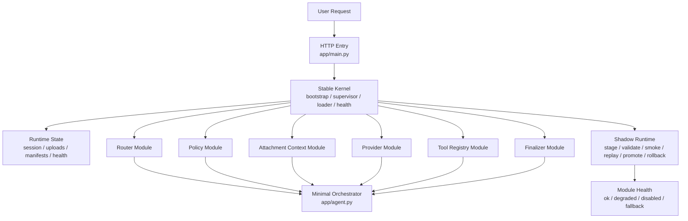
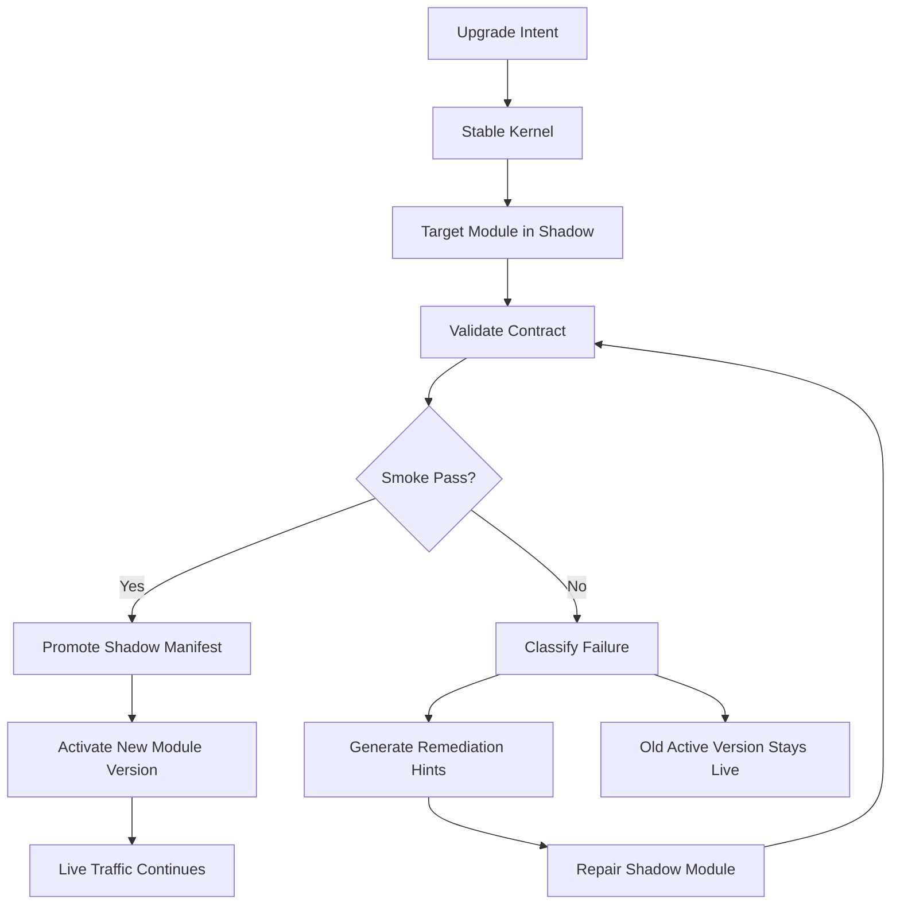

# 模块化内核架构

## 目标

这套系统要演进成一个“稳定内核 + 可替换模块 + 可回滚升级”的运行时。

核心要求只有一个：

- 内核保持简单、稳定、直接
- 外围能力模块化、可替换、可回滚
- 单个模块坏掉时，不拖垮整条链路
- 自我修复只作用于 `shadow` 模块，不直接改线上主干

## 当前结构

当前系统已经不是单体脚本，而是一个分层运行时：

- `stable kernel` 负责加载、调度、健康检查、降级和回滚
- `modules` 负责具体能力
- `shadow` 负责验证、冒烟、晋升和回退

## 当前职责边界

### 内核

内核只做运行时职责，不做业务判断：

- 接请求
- 读取和写回运行时状态
- 加载 active manifest
- 解析模块版本
- 调用模块接口
- 记录健康状态
- 触发降级、回滚和晋升

### 模块

模块只负责单一能力域：

- 路由
- 策略
- 附件上下文
- Provider
- Tool registry
- 最终整理

模块可以失败，但失败不能扩散到其他模块。

### Shadow

`shadow` 是唯一允许自我修复和试错的区域：

- 先 stage
- 再 contracts
- 再 validate
- 再 smoke
- 再 replay
- 通过后 promote
- 不通过就 rollback
- 确定性故障则走 auto-repair

## 未来闭环

未来要做的是“模块级自升级闭环”，而不是“主脑直接改自己”。

## 未来自我升级流程

1. 智能体接到升级任务，只改 `shadow` 模块
2. 内核先做 contract 校验
3. 再做 shadow smoke
4. 再做 replay 或真实回放
5. 通过后原子切换 active manifest
6. 失败则保留旧版本，继续修 shadow

现在已经补上的运行时记录包括：

- `last_upgrade_run`
- `upgrade_runs`
- `last_repair_run`
- `repair_runs`
- `repair_workspaces`

这意味着：

- 主干不因局部升级而失效
- 单模块失败可以隔离
- 升级过程可审计、可回放、可回滚

## 核心设计原则

### 1. 内核简单稳定

内核必须保持最小职责集：

- 加载
- 调度
- 健康检查
- 降级
- 回滚

内核不承载具体业务规则。

### 2. 模块可替换

每个能力域都要有明确接口和版本号。

模块的替换单位不是整套程序，而是一个能力块：

- `router`
- `policy`
- `provider`
- `tool registry`
- `finalizer`

### 3. 失败隔离

任何模块失败都应该局部化：

- `router` 坏了，回退到 safe router
- `provider` 坏了，切换到备用 provider
- `tool registry` 坏了，只禁用相关工具
- `finalizer` 坏了，退回安全输出格式

### 4. Shadow 优先

所有升级先进入 `shadow`：

- `contracts`
- `validate`
- `smoke`
- `replay`
- `auto-repair`
- `promote`
- `rollback`

没有通过这些步骤之前，不允许直接改 active。

### 5. 自修复只作用于 Shadow

自修复的对象是 `shadow` 版本，不是线上主干。

这是为了保证：

- 线上服务持续可用
- 修复过程可重复
- 错误不会把整个系统带死

当前实现里，自修复还会先生成模块级 patch 工作区和 `repair_task.json`。
后续无论是人工修还是 agent 修，都应该只处理 `repair_workspaces` 里的模块副本，而不是直接改 live 模块目录。

### 6. 版本化和可观测性

每次切换都必须留下记录：

- active manifest
- shadow manifest
- rollback pointer
- module health
- last shadow run
- last upgrade attempt

没有记录，就无法可靠回滚和复盘。

## 结构约束

未来不应该再把所有逻辑堆在一个大文件里。

推荐的边界是：

- `app/main.py`：HTTP 入口
- `app/core/*`：稳定内核
- `app/modules/*`：版本化模块
- `app/storage.py`：持久化
- `app/agent.py`：最小 orchestrator

## 结论

这套系统的方向不是“把智能体做得更大”，而是“把它拆成稳定内核和可升级模块”。

内核负责活着，模块负责变化。
升级失败时，活着的那一部分继续服务，失败的那一部分继续在 shadow 里修。
